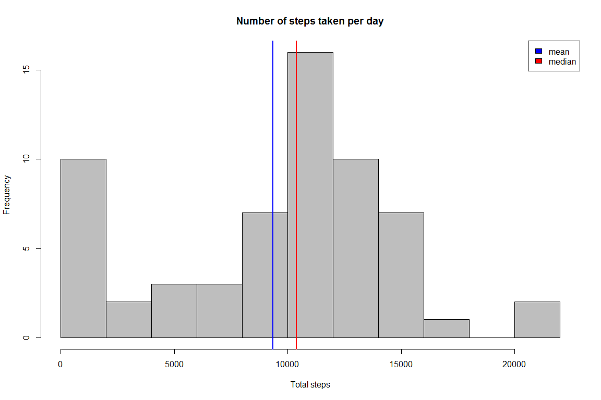
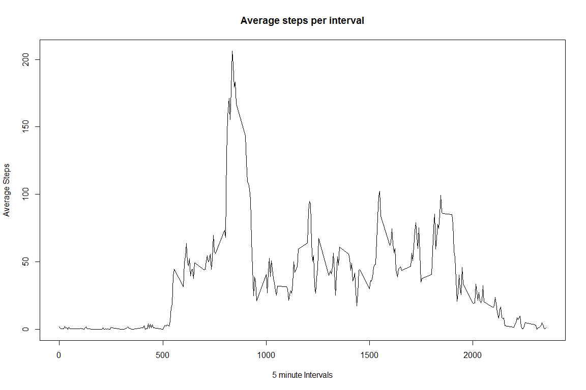
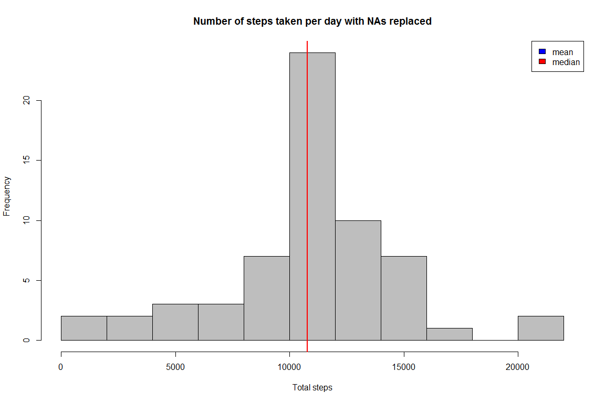
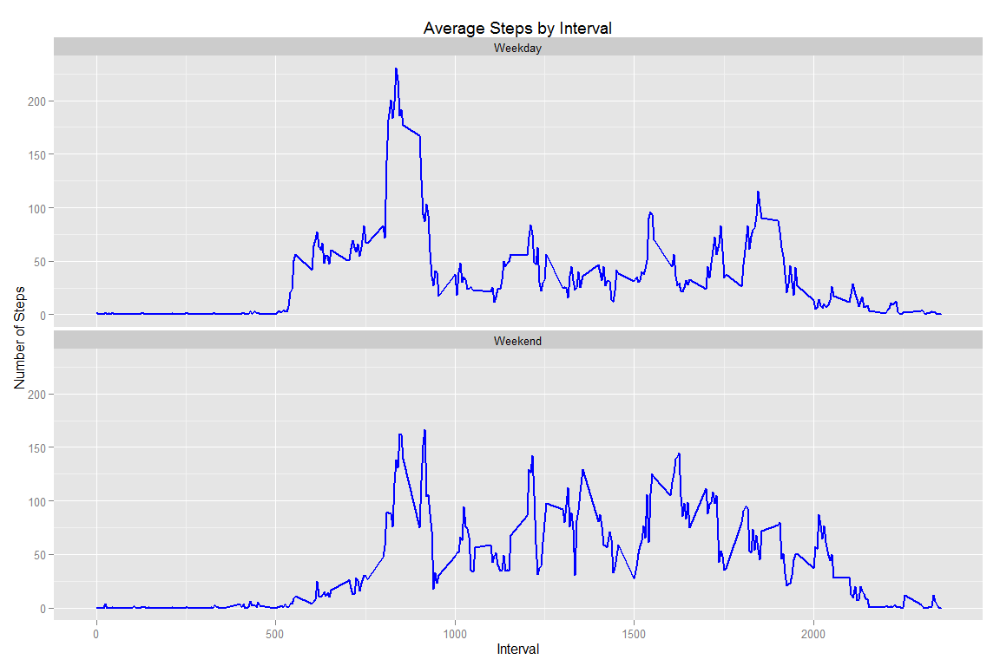

# Reproducible Research: Peer Assessment 1
Rajeev Trikha  


## Loading and preprocessing the data
Load the knitr package and set the global options for the code chunks

```r
library(knitr)
opts_chunk$set(fig.width=12, fig.height=8, fig.path='figure/',echo=TRUE)
```


Read the activity data from the working directory


```r
data <- read.csv("activity.csv",stringsAsFactors = FALSE)
str(data)
```

```
## 'data.frame':	17568 obs. of  3 variables:
##  $ steps   : int  NA NA NA NA NA NA NA NA NA NA ...
##  $ date    : chr  "2012-10-01" "2012-10-01" "2012-10-01" "2012-10-01" ...
##  $ interval: int  0 5 10 15 20 25 30 35 40 45 ...
```

There are 1440 (24*60) minutes in a day. The data has been taken at every 5 minutes interval for the month of October and November in 2012. Check that there are 288 entries (1440/5) for each date of the two months.


```r
table(data$date)
```

```
## 
## 2012-10-01 2012-10-02 2012-10-03 2012-10-04 2012-10-05 2012-10-06 
##        288        288        288        288        288        288 
## 2012-10-07 2012-10-08 2012-10-09 2012-10-10 2012-10-11 2012-10-12 
##        288        288        288        288        288        288 
## 2012-10-13 2012-10-14 2012-10-15 2012-10-16 2012-10-17 2012-10-18 
##        288        288        288        288        288        288 
## 2012-10-19 2012-10-20 2012-10-21 2012-10-22 2012-10-23 2012-10-24 
##        288        288        288        288        288        288 
## 2012-10-25 2012-10-26 2012-10-27 2012-10-28 2012-10-29 2012-10-30 
##        288        288        288        288        288        288 
## 2012-10-31 2012-11-01 2012-11-02 2012-11-03 2012-11-04 2012-11-05 
##        288        288        288        288        288        288 
## 2012-11-06 2012-11-07 2012-11-08 2012-11-09 2012-11-10 2012-11-11 
##        288        288        288        288        288        288 
## 2012-11-12 2012-11-13 2012-11-14 2012-11-15 2012-11-16 2012-11-17 
##        288        288        288        288        288        288 
## 2012-11-18 2012-11-19 2012-11-20 2012-11-21 2012-11-22 2012-11-23 
##        288        288        288        288        288        288 
## 2012-11-24 2012-11-25 2012-11-26 2012-11-27 2012-11-28 2012-11-29 
##        288        288        288        288        288        288 
## 2012-11-30 
##        288
```

Conver the character date format into correct date format in the data frame

```r
data$date = as.Date(data$date,format("%Y-%m-%d"))
```
Check data has been properly transformed to reflect dates correctly

```r
str(data)
```

```
## 'data.frame':	17568 obs. of  3 variables:
##  $ steps   : int  NA NA NA NA NA NA NA NA NA NA ...
##  $ date    : Date, format: "2012-10-01" "2012-10-01" ...
##  $ interval: int  0 5 10 15 20 25 30 35 40 45 ...
```
## What is mean total number of steps taken per day?

Establish total number of steps taken each day, whilst ignoring NAs


```r
library(dplyr)
```

```
## 
## Attaching package: 'dplyr'
## 
## The following objects are masked from 'package:stats':
## 
##     filter, lag
## 
## The following objects are masked from 'package:base':
## 
##     intersect, setdiff, setequal, union
```

```r
dailyTotalSteps <- group_by(data,date) %>%
                            summarise(sum(steps, na.rm=TRUE))
```

Plot the histogram of total steps taken each day using 15 breaks and show mean and median steps.

```r
names(dailyTotalSteps)[2] <- "steps"
daily_mean <- round(mean(dailyTotalSteps$steps),0)
daily_median <- round(median(dailyTotalSteps$steps),0)
hist(dailyTotalSteps$steps,breaks=15,main="Number of steps taken per day",xlab="Total steps",col="grey")
abline(v=daily_mean, lwd = 2, col = "blue")
abline(v=daily_median, lwd = 2, col = "red")
legend("topright",fill=c("blue","red"),legend=c("mean","median"))
```

 

The mean value is 9354 and the median value is 1.0395\times 10^{4}. Check using 5 point summary

```r
summary(dailyTotalSteps$steps)
```

```
##    Min. 1st Qu.  Median    Mean 3rd Qu.    Max. 
##       0    6778   10400    9354   12810   21190
```

## What is the average daily activity pattern?

Establish average number of steps taken during each interval, whilst ignoring NAs


```r
stepsByInterval <- group_by(data,interval) %>%
                            summarise(mean(steps, na.rm=TRUE))
str(stepsByInterval)
```

```
## Classes 'tbl_df', 'tbl' and 'data.frame':	288 obs. of  2 variables:
##  $ interval                 : int  0 5 10 15 20 25 30 35 40 45 ...
##  $ mean(steps, na.rm = TRUE): num  1.717 0.3396 0.1321 0.1509 0.0755 ...
##  - attr(*, "drop")= logi TRUE
```

Plot the average daily activity pattern


```r
names(stepsByInterval)[2] <- "steps"
# Find maximum interval row and the values
maxrow <- which.max(stepsByInterval$steps)
maxInterval <- stepsByInterval[maxrow,1]
maxSteps <- stepsByInterval[maxrow,2]
#plot lines graph
plot(stepsByInterval$interval,stepsByInterval$steps,main="Average steps per interval",xlab="5 minute Intervals",ylab="Average Steps",pch="")
lines(stepsByInterval$interval,stepsByInterval$steps)
```

 

The maximum average steps of 206.1698113 occurs in the interval 835.

## Imputing missing values


```r
missing_steps <- sum(is.na(data$steps))
missing_anywhere <- nrow(data) - sum(complete.cases(data))
```

Rows with NA in steps are 2304. Number of rows with NA in at least one column are 2304. As both values are equal, the NAs only exist in column steps.

We are going to assign the average value for the interval to the missing values.


```r
# use the stepsByInterval dataset created earlier for average steps and rename the seond column
names(stepsByInterval)[2] <- "avg_steps"
# Create a combined dataset which attaches the avg_steps column to the original data
new_data <- left_join(data,stepsByInterval) 
```

```
## Joining by: "interval"
```

```r
# replace NAs with average value
new_data$steps[which(is.na(new_data$steps))] <- new_data$avg_steps[which(is.na(new_data$steps))]

# calculate mean,median and plot
dailyTotalSteps <- group_by(new_data,date) %>%
                            summarise(sum(steps))
# Below is copied from the earlier plot but would normally be better off in a function
names(dailyTotalSteps)[2] <- "steps"
new_mean <- round(mean(dailyTotalSteps$steps),0)
new_median <- round(median(dailyTotalSteps$steps),0)
hist(dailyTotalSteps$steps,breaks=15,main="Number of steps taken per day with NAs replaced",xlab="Total steps",col="grey")
abline(v=new_mean, lwd = 2, col = "blue")
abline(v=new_median, lwd = 2, col = "red")
legend("topright",fill=c("blue","red"),legend=c("mean","median"))
```

 
The new mean value with NAs replaced is 1.0766\times 10^{4} and the median value is 1.0766\times 10^{4}. Check using 5 point summary

```r
summary(dailyTotalSteps$steps)
```

```
##    Min. 1st Qu.  Median    Mean 3rd Qu.    Max. 
##      41    9819   10770   10770   12810   21190
```

The original values for the meaan and median were 9354 and 1.0395\times 10^{4}. It is apparent that the new mean and median are nearly the same. The mean and median lines in the plot are overlapping. The values for both the mean and median have increased too. It was a left skewed plot so replacing NAs has had a slight rightward shift.


## Are there differences in activity patterns between weekdays and weekends?

```r
# create new factor to distiguish between weekday/weekend
new_data$daytype <- as.factor(ifelse(weekdays(new_data$date) %in% c("Saturday","Sunday"), "Weekend", "Weekday")) 
# extract relevant grouped data
steps_daytime_interval <- group_by(new_data,daytype,interval) %>%
                            summarise(mean(steps))
names(steps_daytime_interval)[3] <- "steps"
# this time plot using ggplot
library(ggplot2)
#theme(panel.background=element_rect(fill="darkseagreen"))
g <- ggplot(steps_daytime_interval,aes(interval,steps)) +
          ggtitle("Average Steps by Interval") +
          labs(x="Interval",y= "Number of Steps") +     
          facet_wrap(~daytype,nrow=2) +
          geom_line(size = 1, colour="blue")
g  
```

 
